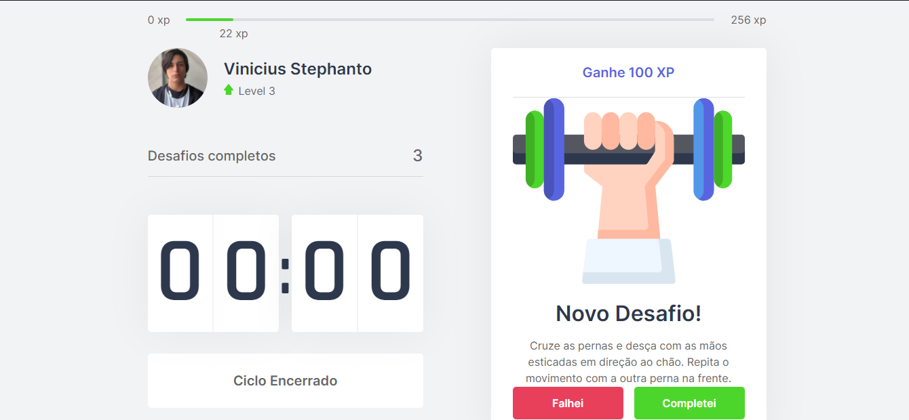

README

<p align="center">
   
</p>

> :rocket: Move It is a project to help people to make more exercises. Next Level Week #04 #NLW @Rocketseat


<div align="center">
  <sub>The NLW #4 project. Built with ❤︎ by
    <a href="https://github.com/stephanto-dev">Vinicius Stephanto</a>
  </sub>
</div>

# :pushpin: Table of Contents

* [Demo Website](#eyes-demo-website)     
* [Technologies](#computer-technologies)
* [Features](#rocket-features)
* [How to Run](#construction_worker-how-to-run)
* [Found a bug? Missing a specific feature?](#bug-issues)
* [License](#closed_book-license)

<br>
<br>

<div>
   
   
</div>

<br>
<br>

# :eyes: Demo Website
The demo website can be missing some features, clone and run the project to a full experience. <br>
👉  demo: 

# :computer: Technologies
This project was made using the follow technologies:

* [Typescript](https://www.typescriptlang.org/)      
* [React](https://reactjs.org/)      
* [Next.js](https://nextjs.org/)      
     

# :rocket: Features

* Pomodoro timer.
* Help to get up of chair and make some exercise.

# :construction_worker: How to run
```bash
# Clone Repository
$ git clone https://github.com/stephanto-dev/moveit.git
```

### 💻 Run Web Project

```bash
# Install Dependencies
$ yarn install

# Run Aplication
$ yarn dev
```
Go to http://localhost:3000/ to see the result.


# :bug: Issues

Feel free to **file a new issue** with a respective title and description on the the [Move.it](https://github.com/stephanto-dev/moveit/issues) repository. If you already found a solution to your problem, **i would love to review your pull request**!


# :closed_book: License

Released in 2020 :closed_book: License

Made with love by [Vinicius Stephanto](https://github.com/stephanto-dev) 🚀.
This project is under the [MIT license](./LICENSE).


Give a ⭐️ if this project helped you!
